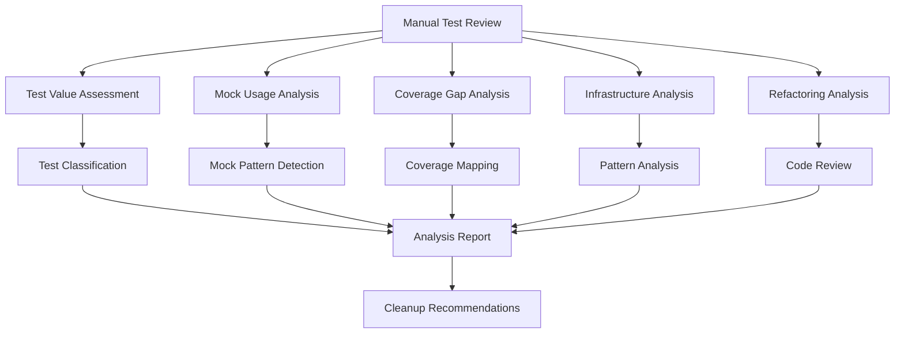

# Design Document: Manual Test Suite Analysis

## Overview

This design creates a comprehensive manual analysis approach for the existing test suite to identify improvements in test value, reduce mock over-reliance, find coverage gaps, and improve test infrastructure. The analysis examines 175+ existing tests across multiple categories and provides actionable recommendations for improvement through expert human review.

## Architecture

The analysis system follows a manual review methodology with structured evaluation criteria:

## Manual Analysis Methodology

### Test Discovery and Categorization

**Approach**: Manual examination of test directory structure and file contents
**Process**:
- Scan test directory structure for all test files
- Categorize tests by type (API, database, WebSocket, infrastructure, etc.)
- Identify archived tests and understand why they were archived
- Map test files to application functionality

### Test Value Assessment

**Approach**: Expert review of each test file for validation value
**Criteria**:
- Does the test validate real application behavior?
- Is the test testing important business logic or just implementation details?
- Does the test catch real bugs or just verify mocks were called?
- Is the test redundant with other existing tests?

**Classification**:
- **High Value**: Tests critical business logic, integration points, error handling
- **Medium Value**: Tests important but not critical functionality
- **Low Value**: Tests trivial functionality, only mocks, or redundant validation

### Mock Usage Analysis

**Approach**: Manual review of mock patterns and usage
**Evaluation Criteria**:
- Are mocks used for external dependencies (good) or internal logic (questionable)?
- Could database mocks be replaced with test databases?
- Are API mocks necessary or could real test clients be used?
- Do mocks test the right abstraction level?

**Categories**:
- **Necessary**: External services, slow operations, non-deterministic behavior
- **Questionable**: Database operations, internal API calls
- **Unnecessary**: Simple utility functions, pure functions
- **Problematic**: Mocking core business logic

### Coverage Gap Analysis

**Approach**: Manual review of application code vs test coverage
**Focus Areas**:
- Critical business logic without tests
- Error handling paths not covered
- Integration points between components
- Configuration and edge cases
- Performance-critical code paths

### Infrastructure Analysis

**Approach**: Review of test infrastructure patterns and consistency
**Evaluation Areas**:
- Fixture usage patterns and opportunities for consolidation
- Database setup and cleanup consistency
- Test utility function duplication
- Configuration management across tests
- Test organization and naming conventions

## Analysis Results

### Test File Classification

#### High-Value Tests (Keep & Enhance)
- `test_api_endpoints.py`: Comprehensive API testing with real database
- `test_api_websockets.py`: Critical WebSocket functionality
- `test_migrations.py`: Database schema integrity

#### Medium-Value Tests (Improve)
- `test_api_simple.py`: Comprehensive but mock-heavy
- `test_api_lightweight.py`: Fast but limited real testing
- `test_api_error_handling.py`: Important error scenarios with some overlap

#### Low-Value Tests (Remove or Consolidate)
- `test_simple_example.py`: Trivial example test
- `test_basic_infrastructure.py`: Meta-testing of test infrastructure

### Key Issues Identified

1. **Over-Reliance on Mocking**
   - Multiple test files create entirely mocked FastAPI applications
   - Database operations mocked instead of using test databases
   - Authentication systems mocked instead of testing real flows

2. **Test Redundancy**
   - API endpoints tested in 4 different files with different approaches
   - Authentication tested separately in each API test file
   - Error handling duplicated across multiple files

3. **Infrastructure Inconsistencies**
   - Different database setup patterns across test files
   - Inconsistent fixture usage and session management
   - Varying approaches to test data cleanup

4. **Missing Coverage Areas**
   - Plugin loading and lifecycle management
   - Task manager concurrency and error handling
   - Database connection resilience
   - Configuration validation edge cases

## Recommendations

### Immediate Actions (High Priority)

1. **Consolidate API Tests**
   - Remove: `test_api_simple.py`, `test_api_lightweight.py`
   - Enhance: `test_api_endpoints.py` with best parts from removed files
   - Result: Single comprehensive API test file

2. **Remove Trivial Tests**
   - Remove: `test_simple_example.py`, `test_basic_infrastructure.py`
   - Reason: No real functionality validation

3. **Standardize Database Testing**
   - Use only `test_database` fixture pattern
   - Update all tests to use consistent session management
   - Implement proper test isolation

### Medium-Term Improvements

4. **Reduce Mock Usage**
   - Replace mocked FastAPI apps with real application testing
   - Use real database operations instead of mocking SQLAlchemy
   - Mock only external services (Stash API, HTTP clients)

5. **Add Missing Test Coverage**
   - Plugin system integration tests
   - Task manager failure scenarios
   - Database connection resilience
   - Configuration validation

6. **Improve Test Organization**
   - Group related tests into logical modules
   - Use consistent naming conventions
   - Add comprehensive docstrings

## Implementation Guidance

### Phase 1: Cleanup (1-2 days)
1. Remove low-value tests
2. Archive redundant test files
3. Consolidate API tests into single comprehensive file

### Phase 2: Standardization (2-3 days)
1. Standardize database fixture usage
2. Implement consistent test data patterns
3. Update all tests to use unified infrastructure

### Phase 3: Enhancement (3-5 days)
1. Replace mocks with real functionality testing
2. Add missing test coverage areas
3. Implement better error handling tests

### Phase 4: Optimization (1-2 days)
1. Optimize test execution speed
2. Add performance tests where needed
3. Document test patterns and conventions

## Expected Benefits

### Immediate Benefits
- **Reduced Maintenance**: 40% fewer test files to maintain
- **Faster Execution**: Elimination of redundant tests
- **Clearer Ownership**: Single source of truth for each test area

### Long-Term Benefits
- **Higher Confidence**: Real functionality testing instead of mocks
- **Better Bug Detection**: Integration tests catch real issues
- **Easier Debugging**: Consistent patterns and clear test structure
- **Improved Reliability**: Standardized infrastructure reduces flaky tests

## Testing Strategy

The improved test suite will use a dual approach:

### Integration Tests
- Test real API endpoints with test database
- Validate actual business logic flows
- Test error handling with real error conditions
- Verify component interactions

### Unit Tests
- Test isolated business logic
- Validate edge cases and boundary conditions
- Test utility functions and helpers
- Mock only external dependencies

**Testing Configuration**:
- Use real test database for all database operations
- Mock external services (Stash API, external HTTP calls)
- Use TestClient for API testing instead of mocked applications
- Implement proper test data factories and cleanup